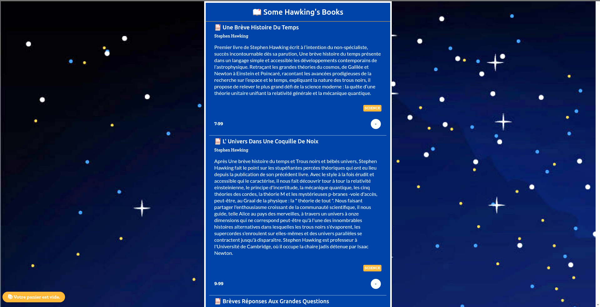

<!-- markdownlint-disable MD033 -->
<techno techs='react,lambda,netlify,stripe,styledComponent'></techs>

Un site qui permet aux clients de découvrir et directement réserver un gîte en Ardèche. A la réception du mail de réservation, le propriétaire peut confirmer la réservation et  envoyer le contrat d'un simple clic.
